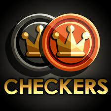
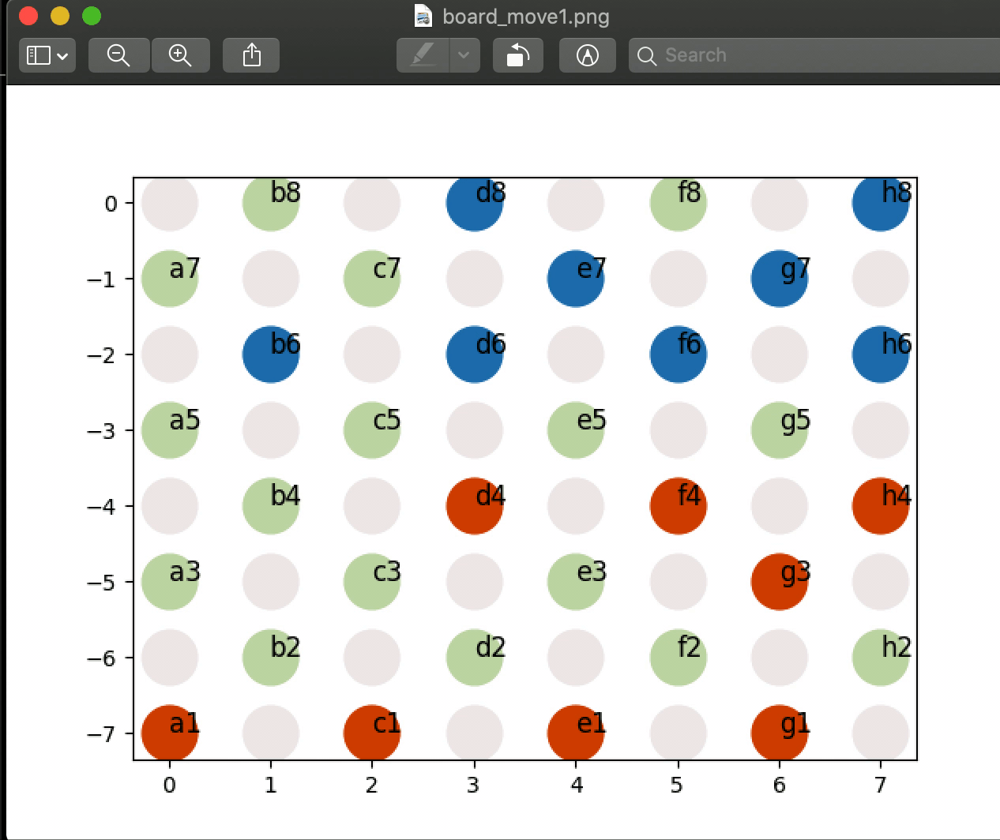

 
  

<h1 align="center"> American Checkers </h1>
<h3 align="center"> CSCI 561 -  Artificial Intelligence </h3>
<h5 align="center"> Assignment 2 - <a href="https://web-app.usc.edu/soc/syllabus/20213/30079.pdf">University of Southern California</a> (Spring 2021)</h5>

 
  

<!-- TABLE OF CONTENTS -->
<h2 id="table-of-contents"> :book: Table of Contents</h2>

  
Table of Contents

  <ol>
    <li><a href="#about-the-project"> ➤ About The Project</a></li>
    <li><a href="#overview"> ➤ Overview</a></li>
    <li><a href="#project-files-description"> ➤ Project Files Description</a></li>
    <li><a href="#getting-started"> ➤ Getting Started</a></li>
    <!--
    <li><a href="#scenario1"> ➤ Scenario 1: Using input output files</a></li>
    <li><a href="#scenario2"> ➤ Scenario 2: Watching the game play</a></li>
    -->
    <li><a href="#credits"> ➤ Credits</a></li>
  </ol>

<!-- ABOUT THE PROJECT -->
<h2 id="about-the-project"> :pencil: About The Project</h2>

 
  English draughts (British English) also called American checkers or straight checkers, is a form of the strategy board game checkers. It is played on an 8×8 checkerboard with 12 pieces per side.

<!-- OVERVIEW -->
<h2 id="overview"> :cloud: Overview</h2>

 
  In this project, the checkers AI agent needs to find the most optimal move to make given an input.txt file of the below format. 'b' and 'w' represent regular black and white coins respectively. 'B' and 'W' represent black and white coins that have become kings coins and can move front and back.
  <pre><code>GAME
BLACK
100.0
........
....W...
.....w..
....W.w.
........
w.w.W.w.
...B....
......w.</code></pre>
The AI agent needs to produce the most viable move output in the following format. If multiple jumps are possible the sequence of jumps needs to be written into the output folder. For the above example input below is one suggested move output which results in most points.
  <pre><code>J d2 f4
J f4 d6
J d6 f8</code></pre>

<!-- PROJECT FILES DESCRIPTION -->
<h2 id="project-files-description"> :floppy_disk: Project Files Description</h2>

<ul>
  <li><b>checkers_agent.py</b> - Reads the input.txt file and writes the best move in output.txt</li>
  <li><b>orchestration.py</b> -  Competes two programs checker_agent_smart.py against <code>checkers_agent_dumb.py</code> alerternatively calling the two programs and making them write and read from their respective input and output files. This visualization can be used to change parameters like minimax depth level, reward calculation arithmetic etc. </li>
  algorithms.</li>
  <li><b>checkers_agent_smart.py</b> - Reads the input_smart.txt file and writes the best move in output_smart.txt plots the output in <code>board_move1.png</code> and modified the <code>input_dumb.txt</code> with the updated move taken</li></li>
  <li><b>checkers_agent_dumb.py</b> - Reads the input_dumb.txt file and writes the best move in output_dumb.txt plots the output in <code>board_move1.png</code> and modified the input_smart.txt with the updated move taken</li>
</ul>

<h3>Some other supporting files</h3>
<ul>

  <li><b>input.txt</b> - Example input file</li>
  <li><b>output.txt</b> - Example output file</li>
  <li><b>board_move1.png</b> - Parses autograder test and solution files.</li>
  <li><b>input_basic.txt</b> - Full board input configuration, can be used to reset smart and dumb agents input.txt</li>
  <li><b>input_smart.txt</b> - Input file read by the smart agent</li>
  <li><b>input_dumb.txt</b> - Input file read by the dumb agent</li>
  <li><b>output_smart.txt</b> - Output file the smart agent writes into</li>
  <li><b>output_dumb.txt</b> - Output file the dumb agent writes into</li>
  
</ul>

<!-- GETTING STARTED -->
<h2 id="getting-started"> :book: Getting Started</h2>

To obtain a single move given the <code>input.txt</code> run the following command:

<pre><code>$ python checkers_agent.py</code></pre>
<i> The move with most points will be saved in the <code>output.txt </code> Orange dots denotes white coins and Blue dots denote black coins. Light orange and Light blue dots denote King coins in the visualization</i>

To start the gameplay between the two agents by type the following command in the command line:

<pre><code>$ python orchestration.py</code></pre>
<i>Note to view the gameplay you need to open <code>board_move1.png </code> Orange dots denotes white coins and Blue dots denote black coins. Light orange and Light blue dots denote King coins in the visualization</i>

<!-- CREDITS -->
<h2 id="credits"> :scroll: Credits</h2>

Rhea Anand

